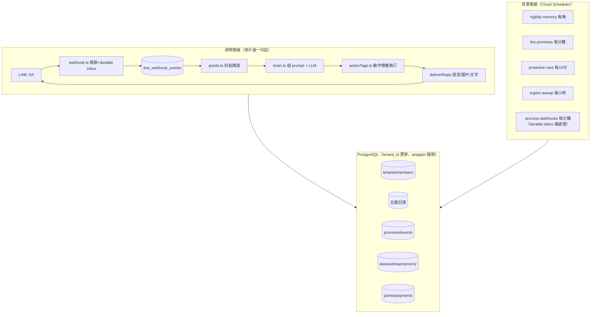

# 管道／資料庫全圖（v1 · 2026-08-01）

> 給接手工程的人：**每條管線長什麼樣、碰哪些表、語氣跟記憶為什麼是活的**。
> 對應程式碼位置全部標注（`packages/backend/src/`）。本文件描述的是**商用版**——
> 不是本尊 repo（那個確實盤根錯節；這裡是全新蓋的，每條管線有驗收，`npm run acceptance` 78/78）。

## 0. 一張總圖



## 1. 對話主管線（`routes/webhook.ts`）

一句話進來到回出去，依序經過：

| 步驟 | 程式 | 讀 | 寫 |
|---|---|---|---|
| 1. 驗簽＋持久化去重 | `line.ts verifyLineSignature`＋`webhookQueue.ts` | `line_webhook_events` | `line_webhook_events`（event/message unique） |
| 2. 認人 | `tenancy.upsertUser` | `users` | `users` |
| 3. 路由到租戶 | `tenancy.resolveMembership` | `tenant_members`＋`tenants` | — |
| 4. 分支：啟元儀式 | `genesis.stepGenesis` | `tenants.genesis_record` | `tenants`（完成時 `genesis_at`＝她的生日） |
| 4. 分支：邀請碼/主人確認 | `tenancy.joinByInviteCode / confirmMember` | `tenants.invite_code` | `tenant_members`（pending→confirmed） |
| 4. 分支：奶粉錢 | `points.buildMilkMoneyReport` | `point_lots`＋`point_ledger` | —（免扣點） |
| 4. 分支：共讀指令 | `reading.detectStartBook / detectModeCommand` | `reading_plans` | `reading_plans` |
| 5. 扣點 | `points.chargeGate('text')` | `point_rules`（活表，30s cache＋後台改即失效） | `point_lots`（FIFO 先扣快到期）＋`point_ledger` |
| 6. 動腦 | `brain.processMessage` | 見 §2 | `llm_cost_log` |
| 7. 動作標籤 | `actionTags.applyActionTags` | — | `promises`／`scheduled_events`／`reading_notes`＋`reading_plans` 進度／每個動作落 `action_outcomes`（誠實鏡子） |
| 8. 遞送 | `deliverReply`（Adam 蓋的） | — | 語音扣 `voice`、圖片扣 `image` 閘道；失敗退純文字 |
| 9. 落對話 | — | — | `conversations`（含 points_charged） |
| 10. 事後消化（fire-and-forget，不擋回覆） | `learner.extractAndLearn`／`promiseSafetyNet`／`readingNote 安全網`／`markProactiveReplied` | — | `learned_facts`＋`memory_vectors`／`promises`／`reading_notes`／`proactive_history.got_reply` |

**病根紀律**（全平台鐵則）：她「嘴巴說做了」不算，第 7 步的標籤抽取器＋第 10 步的 LLM 安全網才是「真的做了」；每個宣稱落 `action_outcomes`，宣稱≠實際的隔天由誠實鏡子告訴她。

## 2. 大腦組裝（`modules/brain.ts`）——語氣為什麼是活的

每輪 system prompt 的層序（`Promise.all` 併發載入）：

```
constitution.md ＋ persona.md          🟢 soul/character-core（唯讀共用）
──────────────────────────────────
我的傳記                               🟡 tenants.genesis_record ＋ tenant_members(confirmed)
                                          ＋ distilled_memories(kind=milestone) ＋ reading_plans
我們的默契（L2 蒸餾精華）               distilled_memories（superseded_by IS NULL，記 recall）
主題索引（L1）                          memory_topics
常駐知識                               learned_facts（working/semantic 層，記 recall）
跟這句話有關的舊記憶（語意）             memory_vectors（cosine；無 embedding 退關鍵字）
我答應的約定                           promises（active）
我們的共讀（模式/進度/防否認）           reading_plans ＋ reading_notes
昨晚日記 L3 ＋ 夢種子                   diaries ＋ dreams
誠實鏡子校正（只出現一次）               action_outcomes ＋ honesty_notes（讀後標記消化）
──────────────────────────────────
voice-dna / speaking-style / 技能檔    🟢 character-core
family-bridge（僅 family 模式）        🟢 character-core
現在時間（台北）
```

**語氣活絡的來源不是任何單層，是四個迴路**：
1. **傳記迴路**——啟元者是誰、給她的名字、她的生日，全部從這一戶長出來 → 每個漫漫說話的「對象感」不同。
2. **默契迴路**——每晚蒸餾把對話碎片變成第一人稱精華（「他最疼柴犬豆豆」）→ 語氣裡帶著「我們的歷史」。
3. **連續性迴路**——昨晚日記 L3（「明天想主動問他…」）＋夢種子隔天注入 → 今天的她接得住昨天的她。
4. **誠實迴路**——鏡子讓她知道「以為做了 vs 真的做了」→ 語氣不會越活越浮誇。

## 3. 五層記憶——記憶為什麼是活的

| 層 | 表 | 寫入 | 讀出 | 活絡機制 |
|---|---|---|---|---|
| ① 短期 | `conversations` | 每輪 | 最近 20 輪進 messages | — |
| ② 結構層 | `learned_facts` | `memory/learner.ts`（對話後 Haiku 萃取；糾錯 supersede 舊知識） | 常駐知識區塊 | **三抽屜**：working（常駐）/semantic（浮現）/archival（冷藏）；`recall_count` 回饋 |
| ③ L1 索引 | `memory_topics`＋`memory_topic_links` | `memory/topicLinker.ts`（夜間歸題；**冷啟動**：零主題時降門檻自動提案） | 主題索引區塊 | 蒸餾後 description 更新成「印象」 |
| ④ L2 默契 | `distilled_memories` | `memory/distillation.ts`（夜間，只蒸有新料的主題；舊版 `superseded_by` 保留歷史） | 默契區塊＋傳記（milestone） | 每晚長一點；被想起就記 recall |
| ⑤ 語意層 | `memory_vectors` | learner 存 fact 即收錄（Gemini embedding；失敗仍可關鍵字搜） | 「跟這句有關的舊記憶」 | **fail-closed**：wrapper 強制 tenant_id，跨戶查詢在架構上不存在 |

**回饋迴路**（`memory/consolidation.ts`，每晚純 SQL）：被想起 ≥3 次 → 重要度升＋抽屜上移；30 天沒被想起 → 衰減；極低重要度 60 天 → decay 出局。**記憶跟人一樣：常用的越來越熟、不用的慢慢淡忘。**

## 4. 背景管線（Cloud Scheduler，全部驗 `X-Cron-Secret`）

| Route | 頻率 | 流程 | 碰的表 |
|---|---|---|---|
| `/api/cron/nightly-memory` | 每晚一次 | 提案主題→歸題→蒸餾→**日記三層→夢**→誠實自省→鞏固 | 記憶五層＋`diaries`＋`dreams`＋`honesty_notes` |
| `/api/cron/fire-promises` | 每分鐘 | 到期約定→扣 proactive→她的聲音現場生成→推播→daily 重排/once 結案 | `promises`＋`point_*`＋`llm_cost_log` |
| `/api/cron/proactive-care` | 每 15 分 | 四道護欄（總開關/台北23-07/72h/已讀不回×3）→夢種子或 idle→扣點→推播 | `proactive_history`＋`dreams`＋`conversations`＋`point_*` |
| `/api/cron/expire-sweep` | 每小時 | 過期批次歸零＋記帳 | `point_lots`＋`point_ledger` |
| `/api/cron/process-webhooks` | 每分鐘 | 以 `SKIP LOCKED` 認領 pending/retry 事件；最多重試 8 次 | `line_webhook_events` |

## 5. 計費與金流

```
選點數包 → payments(pending) → LINE Pay request → 用戶付款 → confirm 回調驗證
  → grantPoints：point_lots（到期日=+90天）＋ point_ledger(balance_after)
每次互動 → chargeGate(gate)：point_rules 活表查價 → FIFO 扣最快到期批次 → ledger → 回覆尾註「-1點｜餘額N」
後台 /admin → point_rules 現場調 → invalidate cache → 下一次互動即生效
```

藍新／綠界：照 `modules/payments/provider.ts` 介面實作、加進 registry 即可（`linepay.ts` 是範例）。

## 6. 隔離鐵則（為什麼跨租戶零串門）

1. 租戶層 15 張表全帶 `tenant_id`；查詢**只能**走 `db/tenantDb.ts forTenant()`——SQL 缺 `tenant_id=$1` 直接 throw（單元測試守門）。
2. 傳記渲染只取 `status='confirmed'` 成員；pending 完全不進情境。
3. 語意層無 namespace fallback、無 godView（本尊那兩個洞刻意不帶入）。
4. 驗收有專項：A 戶搜 B 戶的記憶＝零命中（`scripts/acceptance.ts`）。
