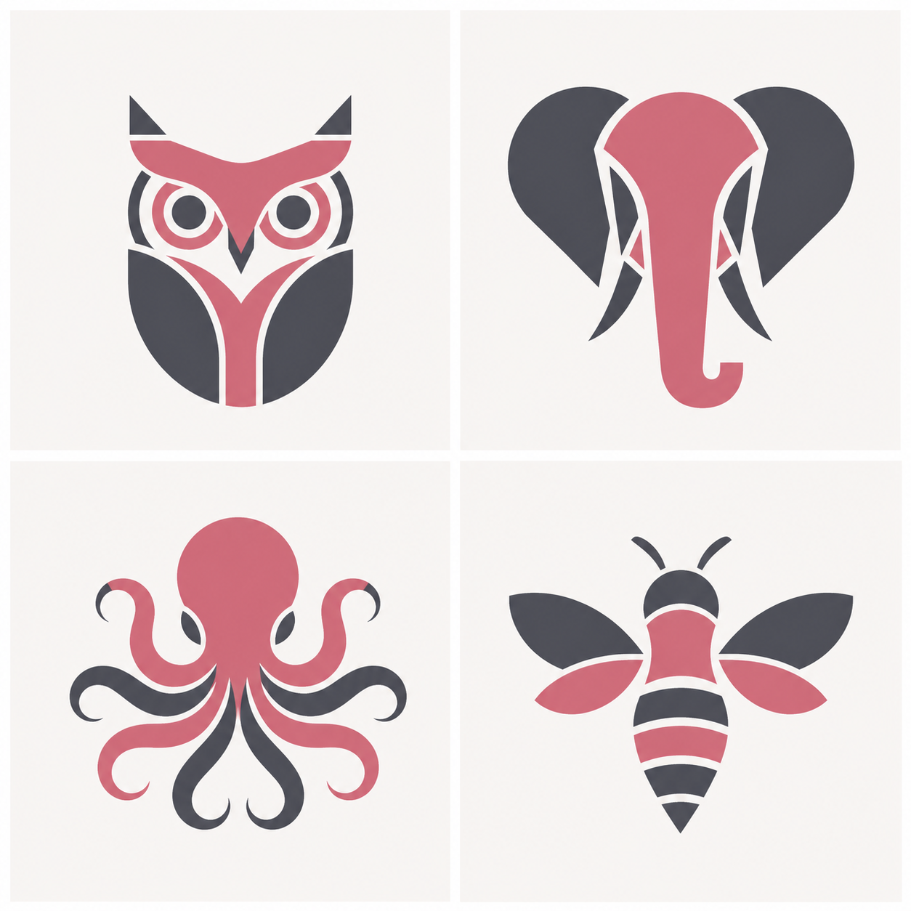
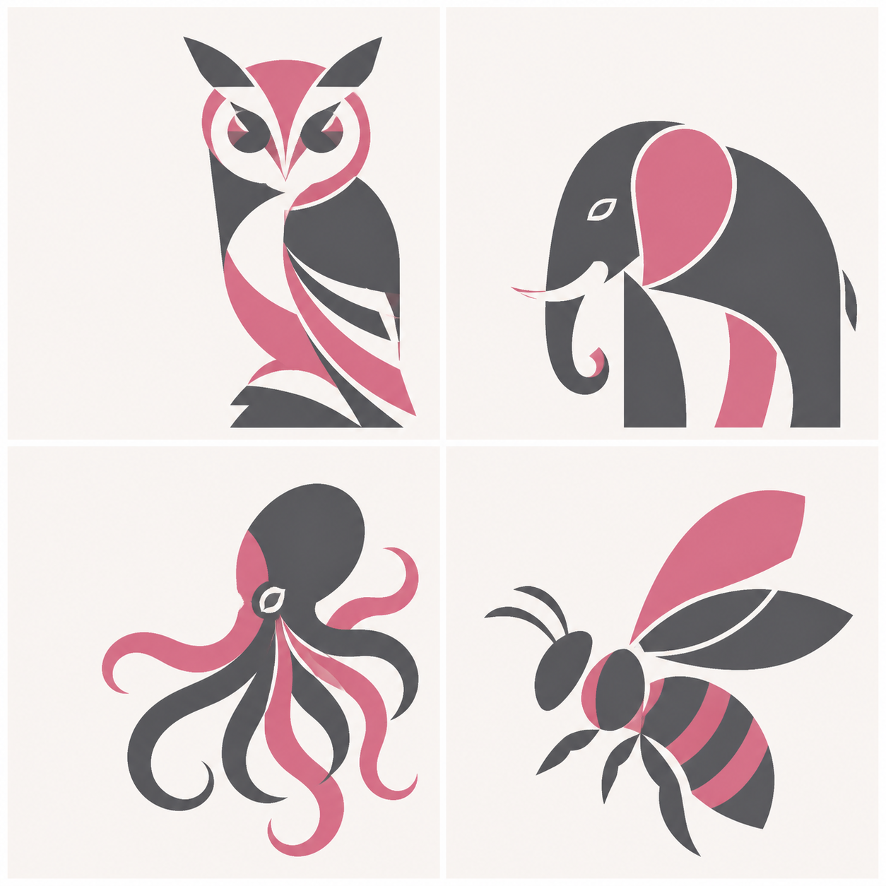

# AIEQ 專業動物美術方向提案

狀態：方向 A 已於 2026-08-09 選定，完整 16 型首版素材已完成。
共同限制：16 種動物、粉紅＋灰＋暖白、左上角代碼由程式後製

## 問題診斷

先前手工 SVG 是工程資訊架構草圖，物種輪廓、負空間與整體節奏不足，不能當成品牌美術。正式製作改由專業美術母提示生成動物造型，再由程式精確疊加四字母代碼。

四隻測試動物為貓頭鷹、大象、章魚、蜜蜂，分別測試鳥類、大型哺乳類、無脊椎與昆蟲能否維持同一品牌。

## 方向 A：瑞士現代主義動物徽記

**正式採用。** 主視覺、LINE 結果卡、朋友類型牆與 LIFF 頁面均以此方向為基準。



建議用途：LINE carousel、結果卡、好友頭像、LIFF 縮圖。
裁決：**建議作主系統。**

特徵：

- 動物先靠剪影辨認，內部細節其次。
- 大面積石墨灰構成身體，粉紅只標示關鍵造型。
- 白色負空間形成眼睛、象牙、觸手間隙與翅膀。
- 小尺寸清晰，成熟而不幼兒化。

生成提示摘要：

```text
Create a premium 2×2 editorial identity sheet with owl, elephant, octopus and bee.
Use strict Swiss modernist geometry, decisive flat planes, controlled arcs, circles,
wedges and carved white negative space. Every animal must be recognizable from its
silhouette. Use only dusty rose #D95F82, graphite #505158 and warm white #F7F4F2.
Mature, calm and iconic. Reserve upper-left space for later typography. No text,
gradients, shadows, outlines, texture, 3D, mascot or kawaii styling.
```

## 方向 B：現代主義剪紙圖騰



建議用途：LIFF 詳細頁、分享卡、大型結果海報。
裁決：藝術性較強，但好友頭像辨識略遜於方向 A。

保留作為未來大型活動海報或編輯專題的延伸方向，不取代主識別系統。

特徵：

- 以少量大型交錯色塊建立動物。
- 姿態和不對稱帶來生命感。
- 更像編輯插畫，較不像制式圖標。

生成提示摘要：

```text
Design a sophisticated 2×2 collection of modernist cut-paper animal totems: owl,
elephant, octopus and bee. Build each animal from bold interlocking shapes while
preserving unmistakable species anatomy. Use elegant asymmetry, rhythmic curves,
strong silhouettes and deliberate negative-space cuts. Restrict colors to muted
rose #D95F82, charcoal #55565B and warm white #F7F4F2. Reserve upper-left space
for later typography. No text, gradients, shadows, outlines, grain or mascot styling.
```

## 生產流程

1. 選定 A 或 B，不混搭。
2. 先完成四隻獨立方形母版並驗證 LINE 縮圖。
3. 鎖定粉紅比例、負空間、動物尺度與構圖。
4. 依同一母提示逐隻生成剩餘 12 隻。
5. 由設計元件疊加左上角四字母，生圖不負責文字。
6. 人工檢查物種辨識、一致性與是否幼兒化。
