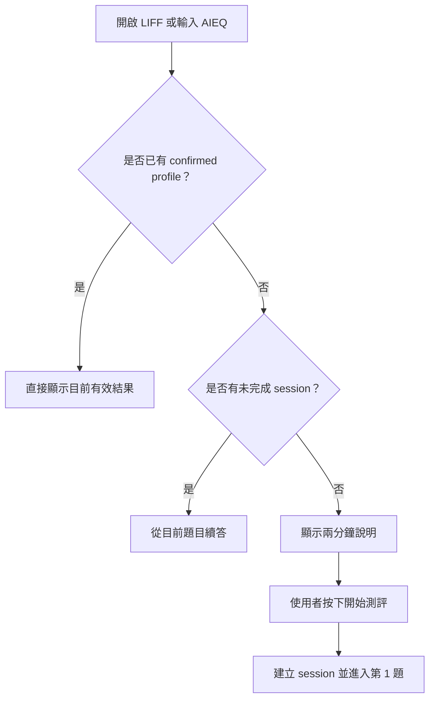
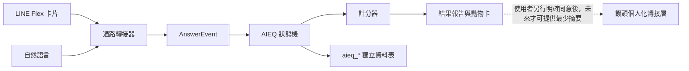
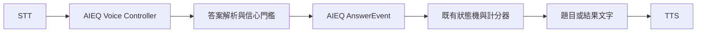

# AIEQ 專案說明書

文件版本：`1.1`
產品階段：可測試原型（尚未正式部署）
整理日期：2026-08-24
開發分支：`codex/aieq-mbti`
版本基準：以本分支 Git 歷史與指定 `instrumentVersion` 為準

---

## 1. 文件目的

本文件提供產品經理、設計、工程、測評內容顧問及商務團隊共同使用，作為 AIEQ 的產品定義、需求範圍、使用流程、資料邊界、驗收方式與後續路線圖。

本文件描述的是目前程式分支中的實際狀態。尚未完成或仍在規劃的功能，會明確標示為「規劃中」，不得在對外提案中描述成已經上線。

---

## 2. 執行摘要

AIEQ 是一套在 LINE OA 中進行的「AI 時代行為傾向互動測評」。使用者透過 8 個具體工作情境，回答自己面對 AI 工具、模糊任務、團隊合作、驗證風險與快速轉型時最可能採取的行動。

系統會產出兩層結果：

1. 四組人格偏好：E／I、S／N、T／F、J／P。
2. 六項可發展的 AIEQ 能力：AI 協作、轉型速度、模糊容忍、主動性、驗證能力、持續學習。

結果再對應一種動物視覺原型，協助使用者理解、記住與分享自己的行為傾向。動物不參與計分，也不代表智力、能力高低、錄取資格或社會階級。

正式定位文字固定為：

> AIEQ 是參考四組人格偏好的 AI 時代行為傾向測評，非心理診斷，也不是官方 MBTI® 測驗。

產品第一版追求的不是「做很多題」，而是讓使用者在約兩分鐘內取得一個目前可理解、可行動、可分享的結果。

---

## 3. 問題與機會

### 3.1 使用者問題

AI 工具快速進入各行各業後，使用者面對的不只是「會不會使用工具」，而是：

- 資訊不完整時，是否能開始行動。
- AI 給出答案時，是否知道如何查證。
- 團隊意見不一致時，如何推進人機協作。
- 工具或流程失效時，能否快速調整。
- 面對新模型時，如何建立自己的學習方法。
- 缺乏明確指令時，是否能主動定義下一步。

傳統人格問卷通常描述穩定偏好，卻較少直接回答「我在 AI 時代如何工作、合作與轉型」。AIEQ 的機會是把人格偏好翻譯成可觀察的 AI 時代行為與可練習能力。

### 3.2 產品機會

- LINE 是低摩擦、使用者熟悉的入口，不需要另外下載 App。
- 情境題比抽象自我評價更容易回答，也更接近實際工作行為。
- 動物原型提升記憶度與分享性。
- 能力輪廓與兩週成長實驗，讓測評結果可以轉化為行動。
- 可延伸至企業培訓、團隊工作坊、職涯探索、教育課程與品牌互動。

---

## 4. 產品定位

### 4.1 一句話價值主張

> 用 8 個 AI 時代工作情境，看見你與 AI 合作、轉型與成長的自然模式。

### 4.2 產品屬性

AIEQ 是：

- AI 時代行為傾向測評。
- 以 LINE OA、Flex 卡片與 LIFF 承載的互動體驗。
- 具有冪等、可續答、可稽核事件紀錄的獨立測評引擎。
- 提供人格偏好、能力輪廓、信心程度與成長建議的產品。

AIEQ 不是：

- 心理診斷。
- 官方 MBTI® 測驗。
- 人才錄取、解僱或淘汰工具。
- 智力、戰力、潛力或社會價值排名。
- 饅頭的新人格或核心靈魂。
- 可以在沒有使用者同意時寫入饅頭永久記憶的資料來源。

### 4.3 目標使用者

第一階段主要使用者：

- 想了解自己如何面對 AI 工作變化的一般職場工作者。
- 正在推動 AI 導入的團隊成員與主管。
- 需要職涯探索或能力升級方向的學習者。
- 企業培訓、團隊工作坊或活動參與者。

不建議的使用方式：

- 單獨作為招募篩選依據。
- 單獨作為績效、升遷或淘汰依據。
- 將人格代碼解讀為固定命運或能力上限。

---

## 5. 產品目標與不做事項

### 5.1 第一版目標

1. 讓使用者能在 LINE 中快速開始並完成 8 題測評。
2. 支援卡片與自然語言兩種回答方式。
3. 支援中斷後自動續答。
4. 產出四組人格偏好、六項能力、信心程度及動物結果。
5. 讓使用者明確確認唯一有效結果。
6. 在使用者主動邀請後，提供有隱私邊界的朋友互見功能。
7. 保持 AIEQ 資料與饅頭一般對話記憶隔離。
8. 提供完整刪除 AIEQ 資料的能力。

### 5.2 第一版刻意不做

- 不提供無限制重測。
- 不做人格排行、稀有度或戰力分級。
- 不宣稱測評已具有臨床或正式心理計量效度。
- 不自動把測評結果寫入饅頭人格或永久 facts。
- 不取得或掃描使用者的 LINE 好友名單。
- 不在正式服務完成 staging 驗收前直接部署。
- 不將規劃中的語音電話版描述成已完成功能。

---

## 6. 核心產品原則

### 6.1 Profile-first

每位使用者只有一個對外有效的 confirmed profile。再次輸入 AIEQ、打開 LIFF 或點擊舊卡片時，系統優先顯示已確認結果，而不是自動建立新測評。

### 6.2 一次確認

使用者完成 8 題後，只需確認一次結果。確認結果、朋友可見及饅頭個人化，是三個彼此獨立的授權，不應綁在同一個按鈕裡一次索取。

### 6.3 不鼓勵刷類型

第一版不提供一般重測入口。反覆重測容易讓使用者測到自己喜歡的類型，削弱資料可信度。未來若需要重測，應命名為「重新校準」，並另訂冷卻期、題庫版本與歷史結果規則。

### 6.4 不強迫回答

使用者可以選擇「不確定」。不確定不會被強迫配分，只會降低該次結果的覆蓋率與信心。

### 6.5 能力可發展、人格不分高低

四組人格偏好描述慣用方式；六項 AIEQ 能力描述目前可觀察、可練習的行為。兩者分開計算，不得用人格類型直接推論能力高低。

---

## 7. 使用者旅程

### 7.1 唯一入口規則



入口不得自行建立 session。只有使用者明確按下「開始測評」才開始新的測評。

### 7.2 測評主流程


### 7.3 中斷與返回

- 使用者直接離開即視為暫停，不需要理解 session 概念。
- 下次進入會自動回到目前題目。
- LINE 使用者可輸入「回上一題」修改最近答案。
- 舊卡片被再次點擊時，不得讓題目重複前進。

### 7.4 自然語言備援

卡片點選是主要路徑，自然語言是備援。只有在文字能可靠對應唯一選項時才配分；若不能可靠判讀，系統應：

1. 說明目前無法確定。
2. 請使用者換個方式回答。
3. 再次顯示該題選項。

系統不得為了讓流程前進而猜測答案。

---

## 8. 八題核心情境

| 題次 | 情境主題 | 主要觀察方向 | 驗證形式 |
|---|---|---|---|
| 1 | 公司導入沒用過的 AI 工具 | 資訊取向、轉型速度、模糊容忍、主動性 | Direct |
| 2 | AI 產出影響客戶的重要分析 | 決策取向、驗證、協作、責任 | Reverse |
| 3 | 團隊用 AI 改善卡住的流程 | 互動取向、協作、主動性 | Direct |
| 4 | 期限前 AI 工作流程突然失效 | 行動取向、轉型速度、模糊容忍 | Reverse |
| 5 | 自動化連續失敗且原因不明 | 資訊取向、驗證、學習與調整 | Cross-check |
| 6 | 團隊對 AI 建議意見分裂 | 決策取向、協作、驗證 | Cross-check |
| 7 | 新 AI 模型出現但資料零散 | 互動取向、持續學習、主動性 | Reverse |
| 8 | 主管只要求用 AI 提高效率 | 行動取向、模糊容忍、主動性、驗證 | Direct |

題目設計護欄：

- 只問近期、具體、可想像的行為情境。
- 每個選項都必須是現實中合理的策略。
- 選項順序不固定方向，避免第一項永遠看起來最好。
- 不使用抽象的「你是不是有創意」等自我評價問題。
- 不把某種 MBTI 偏好直接設計成較好的答案。

實際題目與選項以 [`questions.ts`](../../packages/backend/src/modules/aieq/questions.ts) 為準。

---

## 9. 評估模型

### 9.1 四組人格偏好

| 維度 | 左側 | 右側 | 解讀 |
|---|---|---|---|
| E／I | 互動取向 | 內在加工取向 | 傾向從互動或獨立加工中推進工作 |
| S／N | 具體經驗 | 模式可能性 | 傾向從已知細節或整體可能性理解問題 |
| T／F | 原則分析 | 人際價值 | 傾向以一致原則或人的影響推進決策 |
| J／P | 結構收斂 | 彈性探索 | 傾向先建立結構或邊做邊調整 |

偏好只描述方向，不代表好壞。

### 9.2 六項 AIEQ 能力

| 能力 | 產品定義 |
|---|---|
| AI 協作 | 能否把 AI、同事及利害關係人納入有效合作 |
| 轉型速度 | 面對新工具或流程變化時開始調整的速度 |
| 模糊容忍 | 資訊不完整時仍能安全推進的程度 |
| 主動性 | 能否自行定義下一步、建立實驗或推動任務 |
| 驗證能力 | 是否查證 AI 輸出、來源、反例及風險 |
| 持續學習 | 是否將探索、失敗與方法整理成可重用能力 |

### 9.3 計分方式

每個選項可對多個維度提供 `-1..1` 的有號證據。正負只代表兩端方向，不代表優劣。

```text
balance = Σ(signal × interpretation_confidence)
          / Σ(|signal| × interpretation_confidence)

display_score = 50 + 50 × balance
```

- 人格偏好依 balance 的方向顯示字母。
- 偏好強度採 `abs(balance)`。
- 六項 AIEQ 能力轉為 0～100 顯示分數。
- 自由文字答案會納入 interpretation confidence。

### 9.4 信心程度

信心不是能力高低，而是「目前證據足不足、判讀穩不穩定」。

```text
confidence = coverage
             × interpretation_certainty
             × directional_consistency
```

信心受到以下因素影響：

- 題目是否回答完整。
- 是否選擇不確定或跳過。
- 自由文字是否能可靠對應選項。
- 不同情境中的行為方向是否一致。

低信心時，報告應說「目前證據不足或跨情境表現不同」，不得把接近中點的結果描述成確定人格。

---

## 10. 結果報告

### 10.1 必要內容

每份結果至少包含：

1. 四組人格偏好代碼。
2. 各偏好的方向、強度與信心。
3. 六項 AIEQ 能力分數與信心。
4. AI 時代自然優勢。
5. 容易忽略的盲點。
6. 目前的生存與合作模式。
7. 可執行的兩週成長實驗。
8. 整體信心說明。
9. 固定免責聲明。

### 10.2 文案原則

- 不使用「最強、最弱、菁英、淘汰」等階級語言。
- 不將結果描述成固定命運。
- 優勢、盲點與成長方向必須同時呈現。
- 成長建議必須能在兩週內以低風險方式實驗。
- 低信心時降低結論強度，不為了好看而過度確定。

### 10.3 結果生命週期

```text
none → in_progress → completed_unconfirmed → confirmed
```

實際資料庫 session 狀態為 `in_progress / paused / completed`；`completed_unconfirmed / confirmed` 的產品語意由 session 與 profile 是否存在共同表示。

`confirmed` 是唯一對外有效結果。歷史事件與 session 只用於稽核，不參與朋友圈顯示。

---

## 11. 十六種動物原型

| 類型 | 動物 | 自然優勢摘要 | 主要成長提醒 |
|---|---|---|---|
| ISTJ | 河狸 | 把混亂變成可靠系統 | 用低風險試點替代一次到位 |
| ISFJ | 企鵝 | 穩定照顧團隊與品質 | 把照顧化成可複製流程 |
| INFJ | 大象 | 看見長期影響與人的需求 | 用小型原型驗證願景 |
| INTJ | 貓頭鷹 | 設計長期策略與架構 | 讓利害關係人提早參與 |
| ISTP | 貓 | 快速拆解工具與實際問題 | 把有效解法留下可重用紀錄 |
| ISFP | 小熊貓 | 敏銳察覺體驗與價值衝突 | 為創作建立最小安全框架 |
| INFP | 鹿 | 守住意義、倫理與人的可能 | 設定期限並完成可逆實驗 |
| INTP | 章魚 | 建立模型並探索多條解法 | 先交一個可被否定的版本 |
| ESTP | 獵豹 | 在變動中快速行動與修正 | 在速度流程中加入檢查點 |
| ESFP | 鸚鵡 | 帶動參與並讓新工具容易接近 | 每次實驗留下成果與學習 |
| ENFP | 水獺 | 連結創意、人與新機會 | 用一項標準選出下一步 |
| ENTP | 烏鴉 | 挑戰假設並組合新解法 | 設定停止條件與交付點 |
| ESTJ | 牧羊犬 | 組織資源並推動規模化落地 | 先聽取例外再標準化 |
| ESFJ | 蜜蜂 | 建立協作網絡與採用動能 | 指定反方檢查風險 |
| ENFJ | 海豚 | 帶領他人理解並共同轉型 | 把支持轉為對方自主能力 |
| ENTJ | 虎鯨 | 整合人才、技術與目標前進 | 決策前保留反證與回饋窗口 |

動物映射與正式結果文案以 [`catalog.ts`](../../packages/backend/src/modules/aieq/catalog.ts) 為準。

### 11.1 正式視覺方向

- 風格：Swiss modernist geometric animal emblems。
- Dusty rose：`#D95F82`。
- Graphite：`#505158`。
- Warm white：`#F7F4F2`。
- 16 種人格具有相同視覺地位。
- 人格四碼由 UI 疊加，不讓圖片生成模型生成文字。
- 不使用幼兒卡通、星座、塔羅、RPG、稀有度或戰力視覺。

正式素材位於：`assets/aieq/animals/swiss-modernist/`。

---

## 12. 好友互動與分享

### 12.1 原則

好友功能是「完成結果後的選擇性互動」，不是開始測評的必要條件。

- 使用者只有主動按「邀請朋友」時，才開啟朋友相關流程。
- 系統透過 LINE Share Target Picker 分享邀請網址。
- 系統不取得 LINE 好友名單，也不知道使用者在選擇器中分享給誰。
- 受邀者接受邀請後先進入 pending。
- 受邀者完成並確認自己的結果後，才建立雙向 friendship。
- 雙方是否顯示類型，仍取決於各自的朋友可見設定。

### 12.2 邀請狀態

```text
issued → claimed → accepted
                 ↘ expired
```

### 12.3 防濫用需求

- 邀請 token 必須有期限。
- 同一邀請不可被第三人重複認領。
- friendship 只能在確認結果的交易內建立。
- 刪除任一使用者 AIEQ 資料時，應同步移除相關邀請及 friendship。

---

## 13. 系統架構

### 13.1 系統邊界



AIEQ 核心模組不依賴 LINE，也不匯入饅頭 brain、memory 或 soul 模組。LINE 只是其中一種通路。

### 13.2 正式執行路徑

```text
LINE text / postback
  → signed webhook + durable inbox
  → AIEQ channel adapter
  → idempotent AnswerEvent transaction
  → session projection + scoring
  → result Flex
  → LIFF ID-token verification
  → explicit profile confirmation
  → consented friendship graph
```

### 13.3 統一事件格式

所有卡片、自由文字及系統操作都轉成同一種 `AnswerEvent`：

```json
{
  "eventId": "line:webhook-event-id",
  "sessionId": "aieq_session_id",
  "source": "card | free_text | system",
  "kind": "answer | uncertain | skip | back | pause | resume",
  "occurredAt": "2026-08-10T10:00:00.000Z",
  "questionId": "q01_new_tool",
  "optionId": "a",
  "rawText": "我會先做個小實驗",
  "interpretationConfidence": 0.85
}
```

`eventId` 是冪等邊界。同一個 LINE 點擊或 webhook 重送只處理一次。

### 13.4 狀態機

核心 session 狀態：

- `in_progress`
- `paused`
- `completed`

支援事件：

- `answer`
- `uncertain`
- `skip`
- `back`
- `pause`
- `resume`

原始事件採 append-only 保存；目前有效答案另存為 projection。回上一題只修改 projection，不刪除原始事件，確保稽核軌跡完整。

---

## 14. API 概要

除 `/config` 外，LIFF API 都要求：

```http
Authorization: Bearer <LIFF ID token>
```

| Method | Endpoint | 用途 |
|---|---|---|
| GET | `/api/aieq/config` | 取得 LIFF 設定 |
| GET | `/api/aieq/entry` | 依 profile-first 規則決定入口模式 |
| POST | `/api/aieq/sessions` | 使用者明確開始後建立或續接 session |
| GET | `/api/aieq/sessions/:id` | 取得 session 進度與目前題目 |
| POST | `/api/aieq/sessions/:id/events` | 寫入統一答案事件 |
| POST | `/api/aieq/sessions/:id/confirm` | 確認結果及設定授權 |
| GET | `/api/aieq/me` | 取得本人 AIEQ profile |
| DELETE | `/api/aieq/me/data` | 刪除本人全部 AIEQ 資料 |
| GET | `/api/aieq/friends` | 取得可見的 AIEQ 朋友 |
| POST | `/api/aieq/friend-invites` | 建立限時邀請 |
| POST | `/api/aieq/friend-invites/:token/claim` | 認領邀請 |

後端必須驗證 LIFF ID token，不信任前端直接提交的 LINE user id 或 profile。

---

## 15. 資料模型與隱私

### 15.1 核心資料表

| 資料表 | 用途 |
|---|---|
| `aieq_sessions` | 測評狀態、版本、進度、結果及個人化同意 |
| `aieq_answer_events` | append-only 原始答案事件與冪等紀錄 |
| `aieq_answers` | 目前有效答案 projection |
| `aieq_profiles` | 使用者唯一確認結果與可見設定 |
| `aieq_friend_invites` | 限時邀請及 pending 狀態 |
| `aieq_friendships` | 已成立的雙向關係 |

### 15.2 隱私不變量

以下條件在任何版本都必須維持：

1. AIEQ 預設不寫入 `learned_facts`、soul pack、角色身份或一般對話記憶。
2. 結果確認、朋友可見及饅頭個人化是三種獨立同意。
3. 使用者能刪除自己的 session、profile、邀請與 friendship。
4. 未確認結果不得出現在朋友圈。
5. 不因動物或人格代碼推論使用者適合被錄取或淘汰。

### 15.3 個人化同意

目前程式只保存 `personalization_consent` 的授權狀態，尚未建立把 AIEQ 結果同步至饅頭記憶的背景機制。

未來若啟用，必須：

- 另行向使用者說明用途。
- 只提供最少必要摘要。
- 不複製原始答案成永久 facts。
- 提供撤回與同步刪除機制。

---

## 16. LINE／LIFF 環境需求

正式或 staging 環境需要：

- 同一 Provider 下的 Messaging API channel 與 LINE Login channel。
- LIFF Endpoint：`https://<PUBLIC_BASE_URL>/aieq`。
- LIFF scopes：`openid`、`profile`。
- Share Target Picker。
- Messaging API webhook：`https://<PUBLIC_BASE_URL>/api/webhook/line`。

必要環境變數：

```text
DATABASE_URL
DB_SSL
JWT_SECRET
CRON_SECRET
PUBLIC_BASE_URL
LINE_CHANNEL_TOKEN
LINE_CHANNEL_SECRET
LINE_LOGIN_CHANNEL_ID
LIFF_ID
```

憑證只允許存放在 Secret Manager 或部署環境變數，不得寫入 Git、文件或聊天紀錄。

Messaging API channel 與 LINE Login channel 必須位於同一 Provider，否則同一個真人在 OA webhook 與 LIFF 中會得到不同的 LINE user ID。

---

## 17. 語音電話版規劃

狀態：**架構評估中，尚未實作。**

### 17.1 目標體驗

使用者可在既有雙向通話頁面中，用語音完成 8 題測評：

- 饅頭朗讀情境與選項。
- 使用者說出選項或自然語言回答。
- 系統可靠判定答案；不足時重問。
- 支援插話、中斷、續答及結果朗讀。
- 文字版與語音版共用同一 session、AnswerEvent 與計分結果。

### 17.2 必要架構



### 17.3 關鍵技術原則

- 不把測評回答直接送入饅頭的一般 `processMessage()`。
- AIEQ Controller 決定目前模式、題號、是否重問及何時完成。
- LLM 可以協助理解自由語句，但無權自行改題、跳題或創造分數。
- 低信心回答必須重問，不能猜測。
- WebSocket 與 LiveKit 兩條通話路徑都必須有一致的 session 行為。
- 語音與文字必須共享同一個 canonical profile，不能形成兩份人格結果。

### 17.4 語音版驗收重點

- 題目朗讀後能進入穩定聆聽狀態。
- 使用者能打斷系統語音。
- STT 不確定時不前進。
- 重複的語音事件不會前進兩題。
- 重新連線後回到正確題目。
- 完成後與文字版得到相同計分結果。
- 所有延遲有 STT、判讀、狀態機、TTS 分段日誌。

---

## 18. 目前完成度

### 18.1 已完成

- 8 題核心題庫。
- 四組人格偏好與六項能力分離計分。
- direct、reverse、cross-check 驗證設計。
- 結果信心演算法。
- 統一 AnswerEvent。
- 冪等事件處理。
- append-only 事件與答案 projection。
- 中斷續答與回上一題。
- LINE Flex 三選一卡。
- 自然語言回答備援。
- LIFF 測驗及結果頁。
- profile-first 精簡流程。
- 唯一 confirmed profile。
- 好友邀請、pending、friendship 與朋友可見。
- 完整 AIEQ 資料刪除。
- 16 種正式動物素材與結果文案。
- 開發文件與 staging 驗收指南。

隔壁開發任務回報的驗證結果：

- 74 項單元測試通過。
- PostgreSQL 完整整合測試通過。
- TypeScript build 通過。

### 18.2 尚未完成

- LINE Console staging 設定。
- 隔離 staging service 與 staging database 部署。
- 兩位真人 LINE 帳號端到端驗收。
- 正式分支合併與正式部署。
- 語音電話版 AIEQ。
- 受測者試點與題庫校準。
- 外部心理學／組織行為／測評設計專家審查。
- 商業試點與正式成效數據。

---

## 19. 驗收標準

### 19.1 核心功能

- 使用者只有明確開始後才建立 session。
- 8 題完成後正確顯示結果。
- 卡片與自由文字指向同一選項時，產生相同分數。
- 不確定、回上一題、中斷及續答皆正常。
- 相同 event ID 重送時，題號只前進一次。
- 舊卡片不會覆蓋目前進度。
- 完成後再次進入只顯示 confirmed profile，不建立新 session。

### 19.2 身份與隱私

- 後端成功驗證 LIFF ID token。
- 未確認結果不出現在朋友圈。
- 邀請認領後保持 pending，直到受邀者確認結果。
- 朋友可見與個人化同意可獨立設定。
- 刪除功能會移除所有相關 AIEQ 資料及向量／衍生資料（若未來建立）。
- 正式饅頭記憶沒有被 AIEQ 測試資料寫入。

### 19.3 品牌與內容

- 每份報告包含固定免責聲明。
- 不使用高低階級、戰力或錄取暗示。
- 動物只在結果階段出現，不參與計分。
- 16 種動物在手機縮圖與圓形裁切下仍可辨識。

---

## 20. 建議產品指標

以下為下一階段建議建立的指標，尚無正式基準值：

### 20.1 漏斗

- 看到介紹 → 按下開始的轉換率。
- 開始 → 完成 8 題的完成率。
- 完成 → 確認結果的確認率。
- 確認 → 主動邀請朋友的分享率。
- 受邀開啟 → 完成並確認的轉換率。

### 20.2 體驗品質

- 完成時間中位數。
- 各題停留時間與退出率。
- 「不確定」比例。
- 自由文字無法可靠判讀率。
- 回上一題使用率。
- 平均結果信心與低信心比例。
- 使用者是否認為結果「能理解、像自己、能採取行動」。

### 20.3 技術品質

- Webhook 重送與重複 postback 比例。
- 事件處理失敗率。
- LIFF 登入失敗率。
- session 恢復成功率。
- 完整刪除成功率。
- API p50／p95 延遲。

### 20.4 測評校準

- 各題選項分布是否嚴重偏斜。
- 各維度證據覆蓋是否平衡。
- 不同題目對同一維度的方向一致性。
- 經過合理間隔後重新校準的穩定性。
- 結果敘述是否引發明顯社會期許偏差。

---

## 21. 風險與應對

| 風險 | 影響 | 應對方式 |
|---|---|---|
| 被誤認為官方 MBTI 或心理診斷 | 法務、品牌與使用者誤解 | 固定免責聲明；避免官方化語言 |
| 8 題證據不足 | 結果過度確定 | 顯示信心；低信心降低結論強度；進行試點校準 |
| 使用者選社會期許答案 | 結果失真 | 使用具體情境、合理選項、反向及交叉驗證 |
| 自由文字誤判 | 錯誤前進與錯誤分數 | 唯一匹配才配分；低信心重問 |
| 重複 LINE 事件 | 跳題或重複計分 | event ID 冪等與 transaction |
| 分享造成隱私誤會 | 信任受損 | 按需同意；pending；朋友可見獨立設定 |
| 結果污染饅頭人格 | 核心人格與記憶失真 | 獨立資料表；預設不同意；禁止背景同步 |
| 無限制重測造成刷類型 | canonical profile 失真 | 第一版不提供重測；未來另設重新校準 |
| 動物造成階級或刻板印象 | 產品偏見 | 全角色同等視覺地位；不參與計分；文案同時含優勢與盲點 |
| 語音版使用一般聊天腦 | 題序與答案失控 | 獨立 deterministic Voice Controller |

---

## 22. 建議路線圖

### 階段 A：Staging 驗收

1. 建立隔離的測試 OA、LINE Login channel 與 LIFF。
2. 建立 staging database 及 HTTPS service。
3. 套用 migration 與環境變數。
4. 完成單人全流程驗收。
5. 完成雙人邀請與隱私驗收。
6. 修正 staging 缺陷。

### 階段 B：內容與計分校準

1. 專家審查 8 題及選項。
2. 招募小規模試測者。
3. 分析完成率、題目分布與信心。
4. 調整題目權重、別名及報告文案。
5. 固定 Pilot instrument version。

### 階段 C：有限正式試點

1. 建立試點對象與明確使用場景。
2. 設定資料保留、隱私聲明與客服流程。
3. 部署有限正式版本。
4. 監控漏斗、技術品質及使用者回饋。
5. 形成第一份成效報告。

### 階段 D：語音電話版

1. 核准 Voice Controller 規格。
2. 實作 STT → 判讀 → AnswerEvent → TTS。
3. 接入 WebSocket 與 LiveKit。
4. 完成插話、低信心重問、斷線續答。
5. 比對文字與語音結果一致性。
6. 完成手機真人驗收後再開放。

### 階段 E：產品化與商業擴展

1. 團隊工作坊與企業培訓版本。
2. 管理者只看匿名群體趨勢，不看不必要個資。
3. 建立版本化題庫與重新校準規則。
4. 開發可分享但不造成比較壓力的結果內容。
5. 建立合作方案、定價及客戶成功指標。

---

## 23. 產品經理近期待辦

### P0：可部署性

- [ ] 確認 staging OA、Provider 與 LINE Login channel 的責任人。
- [ ] 確認 staging database、Cloud Run service 與預算。
- [ ] 完成 LINE／LIFF 環境變數設定。
- [ ] 排定單人及雙人手機驗收。
- [ ] 建立缺陷分級與正式上線門檻。
- [ ] 建立 PR 並完成程式審查。

### P1：產品可信度

- [ ] 確認測評內容顧問與審查範圍。
- [ ] 設計小規模試測方案與知情說明。
- [ ] 定義低信心結果的產品行為。
- [ ] 定義 instrument version 與題目變更規則。
- [ ] 完成隱私政策、資料保存期限與刪除說明。
- [ ] 審查 16 型結果文案，排除刻板印象及能力排名。

### P2：成長與提案

- [ ] 完成專案提案簡報與兩分鐘 Demo。
- [ ] 選定第一個商業試點場景。
- [ ] 定義試點成功指標。
- [ ] 建立邀請分享及活動版素材規格。
- [ ] 評估是否進入語音電話版開發。

---

## 24. 待產品決策事項

1. 第一個試點應選企業培訓、職涯探索、品牌活動，還是封閉朋友測試？
2. 低信心到什麼程度時，只顯示「探索者」而不顯示四碼？
3. 結果確認前是否允許使用者回到題目修改？
4. 未來「重新校準」的冷卻期與版本規則為何？
5. 朋友能看見四碼、動物、能力輪廓中的哪些內容？
6. 原始答案及事件的資料保存期限為何？
7. 企業版是否只提供匿名群體統計，如何設定最小群體門檻？
8. 語音版是否屬於首波產品承諾，或等文字版校準後再做？
9. AIEQ 品牌是否獨立於饅頭，或由饅頭作為主要入口與引導者？
10. 對外是否只使用 AIEQ 名稱，避免把 MBTI 放在產品主名稱中？

---

## 25. 專案檔案索引

### 產品與設計

- `docs/AIEQ-SPEC.md`：第一階段產品與技術規格。
- `docs/aieq/AIEQ-CLASSIFICATION-LOGIC-AND-QUESTION-BANK.md`：雲端同步的 16 型分類因果、完整八題選項、權重、提示詞與企劃共創規則。
- `docs/aieq/AIEQ-LEAN-FLOW.md`：精簡後的產品流程。
- `docs/aieq/result-report.example.md`：結果報告示例。
- `docs/aieq/AIEQ-GEOMETRIC-ANIMAL-VISUAL-SYSTEM.md`：正式動物視覺規範。
- `assets/aieq/animals/swiss-modernist/`：16 型正式動物素材。
- `docs/aieq/deliverables/AIEQ-16-animal-personality-handbook-planner-edition.docx`：16 型動物人格設定與企劃共創手冊。
- `docs/aieq/deliverables/AIEQ-proposal-swiss-style.pdf`：AIEQ 瑞士風格提案簡報。
- `assets/aieq/digiasia/`：DigiAsia 大會活動版三畫面與分享卡驗證稿。

### 工程

- `packages/backend/src/modules/aieq/questions.ts`：8 題題庫。
- `packages/backend/src/modules/aieq/scoring.ts`：計分與信心。
- `packages/backend/src/modules/aieq/stateMachine.ts`：狀態機。
- `packages/backend/src/modules/aieq/repository.ts`：持久化及 transaction。
- `packages/backend/src/modules/aieq/channel.ts`：LINE 通路轉接器。
- `packages/backend/src/modules/aieq/flex.ts`：LINE Flex 卡片。
- `packages/backend/src/routes/aieq.ts`：LIFF API。
- `packages/backend/public/aieq.html`：LIFF 前端。
- `packages/backend/src/db/migrations/013_aieq_engine.sql`：核心資料表。
- `packages/backend/src/db/migrations/014_aieq_pending_friend_invites.sql`：pending 邀請流程。
- `packages/backend/test/aieq.test.ts`：自動測試。

### 部署與驗收

- `docs/aieq/AIEQ-IMPLEMENTATION.md`：端到端實作狀態。
- `docs/aieq/LINE-LIFF-STAGING-GUIDE.md`：staging 建立與手機驗收步驟。

---

## 26. 最終產品判定

AIEQ 目前已不是只有概念或視覺稿，而是一套具有題庫、計分、狀態機、LINE／LIFF 互動、持久化、好友授權、資料刪除及自動測試的可測試原型。

它距離正式產品仍有三個主要關卡：

1. 完成隔離 staging 與真人端到端驗收。
2. 完成題目、權重及結果敘述的小規模校準。
3. 完成隱私、版本、正式部署與產品營運決策。

語音電話版是可行的下一階段，但必須建立獨立 AIEQ Voice Controller，不能直接依賴饅頭的一般聊天邏輯。正式規劃與對外承諾應以此邊界為準。
